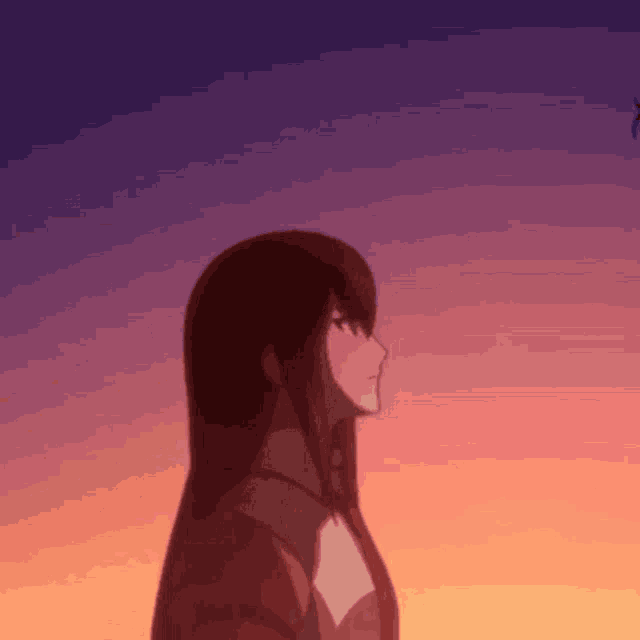

<h1 align="center">Hi 👋, I'm Defry Yandy (a.k.a. Deyand03)</h1>
<h3 align="center">💻 Student | 🌌 Curious Mind | 🧪 WIBUU 
</h3>
<h2 align="center">

</h2>

---

<br><br><br>

  
### 🧠 About Me
- 🎓 I'm a university student majoring in Information Systems
- 🚀 Passionate about **Game Dev, IoT, Web Dev, Cybersecurity, and Networking**
- 🧪 Love exploring **new knowledge, time travel theories, and the universe**
- 🎮 Currently making a 2D magic-based game in **Godot Engine**
- 🛠️ Also learning **Laravel**, **React/Next.js**, **Machine Learning**, **Python** and **C# with WinForms**
<br><br><br><br>

---

### 💖 My Waifu
> "Theories are nothing more than words. Accepting them means admitting defeat to the unknown." – **Makise Kurisu**

<p align="center">
  
</p>

```markdown
📌 Favorite Waifu: Makise Kurisu 🧠
🔭 From: Steins;Gate
🧃 Why? She's brilliant, tsundere, and totally waifu material
```

---

### 📈 GitHub Stats
<p align="center">
  
  
</p>

---

### 🧰 Tech Stack
<p align="left">

  
  
  
  
  
  
  
  
  
  
  
  
  
  
  
  
  
</p>


---

### 📝 Latest Projects
| Project    | Description         | Tech                  |
| ---------- | ------------------- | --------------------- |
| Portofolio | My First Portofolio | HTML, CSS, Javascript |

---

### 🍥 Otaku Section
<p align="center">
  
</p>

- ✨ Favorite Anime: 
**Steins;Gate**, **Re:Zero**, **Violet Evergarden**, **Attack on Titan**, **Jujutsu Kaisen**
- 🎧 Favorite OST: 
*Last Game - Steins;Gate 0*, *Stay Alive - Re:Zero*
- 🎮 Fave Games:
**Persona 5**, **Genshin Impact**, **Honkai: Star Rail**
- 🎨 Hobbies: 
Drawing, Playing Guitar, Watch Anime


---

<p align="center">
  <i>"Live with curiosity, build with passion, love with courage."</i>
</p>